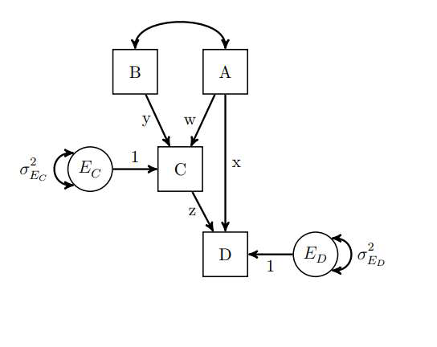

O arquivo `Rmarkdown` que gerou este documento pode ser encontrado [aqui](https://github.com/diegogaldinof/disciplina-psicometria/blob/master/Aula%201%20-%20Introducao%20a%20psicometria/exercicios.Rmd).

## Exercício 1

<br>

```{r include=FALSE}
library(knitr)
library(lavaan)
library(semPlot)
library(psych)
library(prettydoc)

opts_chunk$set(warning = FALSE,
               error = FALSE,
               eval = TRUE,
               message = FALSE,
               fig.align = "center")
```

```{r out.width="60%", echo = FALSE}

```


#### Expressar o modelo de trajetória representado na figura acima usando a sintaxe do pacote `lavaan` do R.

<br>

**Modelo**

```{r}
modelo <- "C ~ w*A + y*B
           D ~ z*C + x*A
           B ~~ A
           yz := y*z
           wz := w*z
           Total := x + yz + wz"
```

**Prova**

```{r out.width="60%"}
# dummy data
nomes <- c("A", "B", "C", "D")

df <- data.frame(rnorm(500),
                 rnorm(500),
                 rnorm(500),
                 rnorm(500))
covar <- cov(df)
rownames(covar) <- colnames(covar) <- nomes

# SEM
mod <- sem(modelo, sample.cov = covar, sample.nobs = 500)
semPlot::semPaths(mod, layout = "spring",
    style = "lisrel", what = "path",
    whatLabels = "path", rotation = 1,
    edge.color = "black", edge.label.cex = 1.25,
    nCharNodes = 3, sizeMan = 8,
    sizeInt = 4)

```


## Exercício 2

<br>

#### 2.1 Input the covariances into R.

<br>

```{r}
nomes <- c("TeacherExpectances", "SocialClimate",
           "MaterialCovered", "StudentAchievement")
dados <- c(84.85,
           71.28, 140.34,
           18.83, -6.25, 72.92,
           60.05, 84.54, 37.18, 139.48)

covar <- getCov(dados, names = nomes)
```


```{r echo = FALSE}
covar2 <- covar
rownames(covar2) <- c("Teacher Expectances", "Social Climate",
                      "Material Covered", "Student Achievement")
colnames(covar2) <- c("TE", "SC", "MC", "SA")
kable(covar2)
```


<br>

#### 2.2 Write the sintax for the model.

<br>

**Modelo**

```{r}
modelo <- "MaterialCovered ~ a2 * TeacherExpectances
           StudentAchievement ~ b1 * SocialClimate + b2 * MaterialCovered + c * TeacherExpectances
           SocialClimate ~ a1 * TeacherExpectances
           # Indirect effects
           a1b1 := a1 * b1
           a2b2 := a2 * b2
           Total := (a1*b1) + (a2*b2) + c"
```

**Prova**

```{r}
mod <- sem(modelo, sample.cov = covar, sample.nobs = 40)
semPlot::semPaths(mod, layout = "tree",
    style = "lisrel", what = "path",
    whatLabels = "path", rotation = 2,
    edge.color = "black", edge.label.cex = 1.25,
    nCharNodes = 3, sizeMan = 8,
    sizeInt = 4)
```


<br>

#### 2.3 What are the indirect effects?

<br>

**Modelo**

```{r}
semPlot::semPaths(mod, layout = "tree",
    style = "lisrel", what = "path",
    whatLabels = "std", rotation = 2,
    edge.color = "black", edge.label.cex = 1.25,
    nCharNodes = 3, sizeMan = 8,
    sizeInt = 4)
```


**Output**

```{r}
summary(mod, std = TRUE, fit = TRUE, rsq = TRUE)
```

<br>

Pelo `lavaan`, podemos calcular o efeito indireto da variável *Teacher Expectances* subtraindo o efeito *Total* (última linha da saída), 0.527, do efeito direto entre *Teacher Expectances* e *Student Achievement* (aba *Regression*: StudentAchievement ~ TchrExpct (c)), 0.084.

$$0.527 - 0.084 = 0.443$$
Temos que o efeito indireto foi de 0.443. Usarei a função `psych::mediate` para testar o resultado.

<br>

**`psych::mediate`**

```{r}
mod2 <- mediate(y = "StudentAchievement",
             x = "TeacherExpectances",
             m = c("MaterialCovered", "SocialClimate"),
             std = TRUE, data = covar, n.obs = 40)
```


```{r echo = FALSE}
mod2
```

<br>

Por sua vez, a função `psych::mediate` sugere que o efeito indireto foi de 0.46. Esse efeito também pode ser escrito em função do efeito *Total* (0.55) menos o efeito *Direto* (0.09) da variável *Teacher Expectances* sobre *Student Achievement*


<br>


## Exercício 3

<br>

#### 3.1 Enter the covariance matrix into R.


<br>


```{r}
nomes <- c("D1", "D2", "D3", "SA", "F",
           "CC", "PA", "PM")

v <- c(0.77,
       0.38, 0.65,
       0.39, 0.39, 0.62,
       -0.25, -0.32, -0.27, 6.09,
       0.31, 0.29, 0.26, -0.36, 7.67,
       0.24, 0.25, 0.19, -0.18, 0.51, 1.69,
       -3.16, -3.56, -2.63, 6.09, -3.12, -4.58, 204.79,
       -0.92, -0.88, -0.72, 0.88, -1.49, -1.41, 16.53, 7.24)

covar <- getCov(v, names = nomes)
kable(covar)
```


<br>

#### 3.2 Fit the SEM model to the data. 

```{r}
modelo <- "PsychH =~ D1 + D2 + D3 + SA
           PhysicalH =~ CC + PA + F
           PM ~ PsychH + PhysicalH"

ex3 <- sem(modelo, sample.cov = covar, sample.nobs = 6053, std.lv = TRUE)
semPlot::semPaths(ex3, layout = "tree",
    style = "lisrel", what = "path",
    whatLabels = "std", rotation = 1,
    residuals = TRUE, edge.color = "black",
    edge.label.cex = 1.25, nCharNodes = 3,
    sizeMan = 8, sizeInt = 4)
```


#### 3.3 Are both psychosocial and physical health preditive of personal mobility?


```{r}
summary(ex3, std = TRUE, fit = TRUE, rsq = TRUE)
```
<br>

Sim. Podemos ver que tanto Poor Psychosocial Health (carga do fator = 0.101) e Poor Physical Health (carga do fator = -0.914) são preditores de Personal Mobility (p < 0.05). No entanto, as magnitudes e as direções são diferentes.

Enquanto que o aumento de 1 desvio-padrão na variável latente Poor Psychosocial Health aumenta, em média, 0.1 desvios-padrões do indicador Personal Mobility, o aumento de 1 desvio-padrão na variável latente Poor Physical Health diminui, em média, 0.91 desvios-padrões do indicador.


